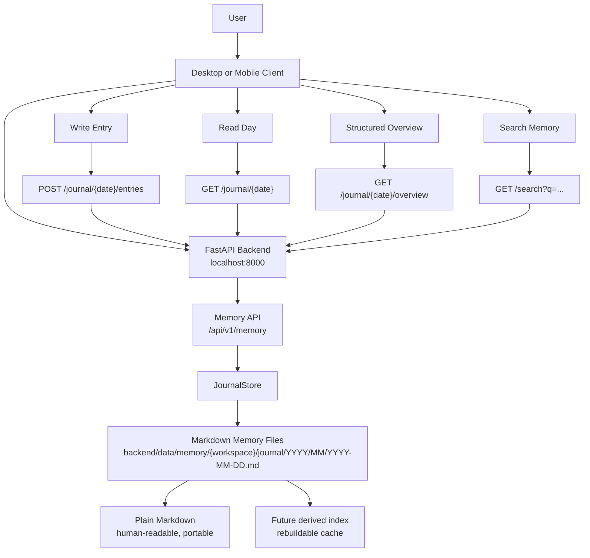
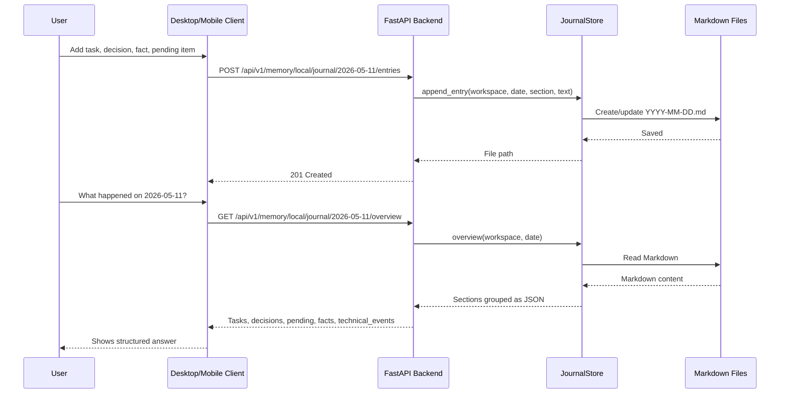
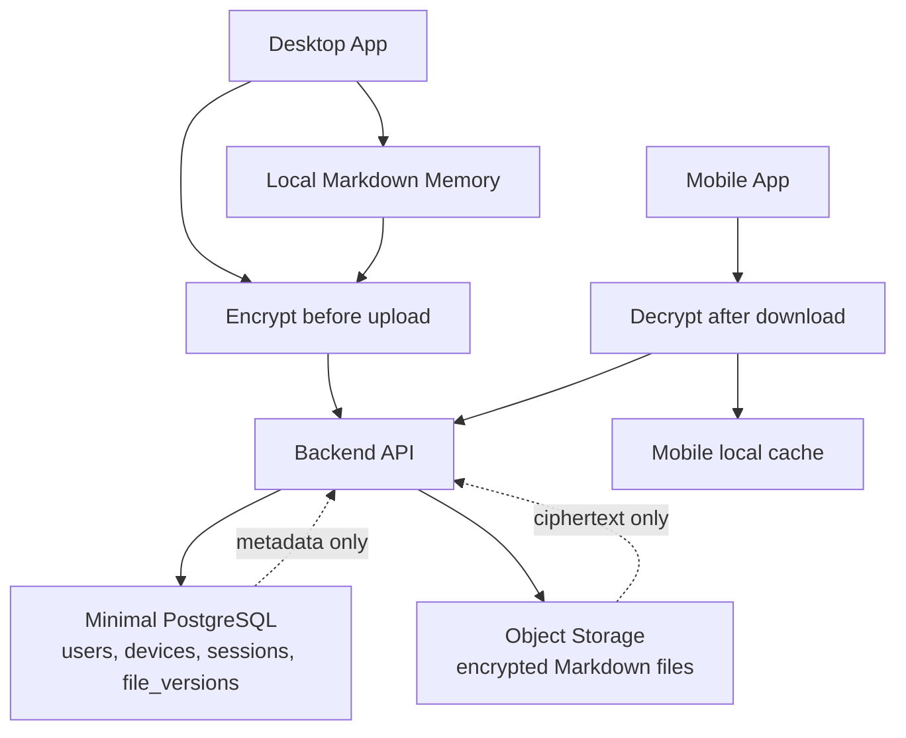

# Foundation Flow

This is the current local-first foundation. The source of truth for assistant memory is Markdown, while the backend exposes a small API to write, read, summarize-by-section, and search it.

## Request Flow

## Planned Secure Flow

## Current Implementation

- Memory root: `backend/data/memory`
- API module: `backend/app/api/v1/endpoints/memory.py`
- Store module: `backend/app/memory/journal.py`
- Tests: `backend/tests/unit/test_journal_store.py`, `backend/tests/integration/test_memory_api.py`
